# A3-系统技术架构图

> Mermaid格式 · 6层架构 · 含技术选型与数据流

```mermaid
graph TB
    %% ====== 样式定义 ======
    classDef frontend fill:#EEEDFE,stroke:#7F77DD,stroke-width:1px,color:#3C3489
    classDef gateway fill:#E6F1FB,stroke:#378ADD,stroke-width:1px,color:#185FA5
    classDef orchestrator fill:#FAEEDA,stroke:#BA7517,stroke-width:1px,color:#854F0B
    classDef agent fill:#EAF3DE,stroke:#639922,stroke-width:1px,color:#3B6D11
    classDef llm fill:#FBEAF0,stroke:#D4537E,stroke-width:1px,color:#993556
    classDef storage fill:#E1F5EE,stroke:#1D9E75,stroke-width:1px,color:#0F6E56
    classDef dataflow fill:none,stroke:#888780,stroke-width:1px,stroke-dasharray:5 3,color:#5F5E5A

    %% ====== 1. 前端展示层 ======
    subgraph "1. 前端展示层 (Frontend)"
        direction TB
        FE_WEB["🌐 Web端
        React 18 + Next.js 14
        TypeScript + TailwindCSS"]
        
        FE_STATE["状态管理
        Zustand + React Query
        
        管理：用户状态、Agent会话、
        资源缓存"]
        
        FE_COMP["核心组件库
        shadcn/ui + Radix UI
        
        · 流式文本渲染 (SSE流)
        · Markdown/LaTeX渲染 (remark-math)
        · 思维导图 (markmap)
        · 代码编辑器 (Monaco Editor)
        · 图表 (ECharts/Recharts)
        · 代码在线运行 (Pyodide WASM)"]
        
        FE_WS["WebSocket连接
        用于Agent消息推送
        学习进度实时同步"]
        
        FE_WEB --> FE_STATE
        FE_STATE --> FE_COMP
        FE_COMP --> FE_WS
    end

    %% ====== 2. API网关 ======
    subgraph "2. API网关层 (Gateway)"
        direction TB
        GW_NGINX["反向代理
        Nginx / Caddy
        
        · HTTPS终结
        · 静态资源托管
        · 负载均衡"]
        
        GW_AUTH["认证鉴权
        JWT Token + OAuth2
        
        · 微信扫码登录
        · 手机号验证码
        · 角色鉴权(student/teacher)"]
        
        GW_RATE["流量控制
        Redis + Sentinel
        
        · IP级别限流
        · API配额管理
        · DDoS防护"]
        
        GW_ROUTE["路由分发
        FastAPI Gateway
        
        /api/agent/* → Agent编排层
        /api/chat/* → 实时对话
        /api/resource/* → 资源管理
        /api/user/* → 用户服务
        /ws/* → WebSocket"]
        
        GW_NGINX --> GW_AUTH --> GW_RATE --> GW_ROUTE
    end

    %% ====== 3. 多Agent编排层 ======
    subgraph "3. 多Agent编排层 (Orchestrator)"
        direction TB
        ORCH_CORE["🧠 Orchestrator 核心
        Python FastAPI + Celery
        
        · 请求意图解析
        · Agent路由选择
        · 任务队列调度
        · 多Agent协同工作流"]
        
        ORCH_CTX["上下文管理器
        Redis + MongoDB
        
        · 会话上下文持久化
        · Agent间消息传递
        · 短期/长期记忆管理
        · 画像缓存同步"]
        
        ORCH_FLOW["工作流引擎
        基于LangGraph / 自研DSL
        
        典型流程：
        诊断 → 规划 → 生成 → 质检 → 交付
        
        异常处理：
        生成失败 → 自动重试(3次)
        质检不合格 → 回退生成Agent迭代
        超时 → 返回部分结果+进度提示"]
        
        ORCH_TASK["任务调度
        Celery + Redis Broker
        
        · 异步资源生成
        · 定时学情评估
        · 批量质检任务
        · 进度推送(WebSocket)"]
        
        ORCH_CORE --> ORCH_CTX
        ORCH_CORE --> ORCH_FLOW
        ORCH_CORE --> ORCH_TASK
    end

    %% ====== 4. Agent层 ======
    subgraph "4. 多智能体层 (Agent Layer)"
        direction TB
        
        AGENT_DIAG["🩺 诊断Agent
        工具：Prompt Chain + Few-shot
        
        职责：
        · 多轮对话画像采集
        · 自适应测验生成
        · 知识薄弱点推理
        · 认知风格识别
        输出：6维学生画像JSON"]
        
        AGENT_PLAN["📋 规划Agent
        工具：知识图谱 + 拓扑排序
        
        职责：
        · 学习路径生成
        · 前置依赖解析
        · 时间/难度平衡
        · 路径动态调整
        输出：学习路径JSON"]
        
        AGENT_GEN["📖 生成Agent
        工具：LLM + RAG + Template
        
        职责：
        · 讲义/文档生成
        · 思维导图生成
        · 练习题生成
        · 代码案例生成
        · 拓展阅读推荐
        输出：多模态资源"]
        
        AGENT_QC["🔍 质检Agent
        工具：LLM + Rule Engine
        
        职责：
        · 事实性校验 (RAG约束)
        · 难度匹配评估
        · 安全内容过滤
        · 格式规范检查
        · 可读性评分
        输出：质检报告(通过/驳回/建议)"]
        
        AGENT_TUTOR["💡 辅导Agent
        工具：LLM + RAG + Socratic
        
        职责：
        · 实时问答
        · 多模态解答(文字+图解+视频)
        · 学习建议推送
        · 学情报告生成
        输出：自然语言解答+建议"]
    end

    %% ====== Agent间协作关系 ======
    AGENT_DIAG -.->|"① 传递画像"| AGENT_PLAN
    AGENT_PLAN -.->|"② 传递路径"| AGENT_GEN
    AGENT_GEN -.->|"③ 提交资源"| AGENT_QC
    AGENT_QC -.->|"④ 不合格→回退"| AGENT_GEN
    AGENT_QC -.->|"④ 通过→推送"| AGENT_TUTOR
    AGENT_TUTOR -.->|"⑤ 答疑反馈更新画像"| AGENT_DIAG

    %% ====== 5. 大模型推理层 ======
    subgraph "5. 大模型推理层 (LLM Layer)"
        direction TB
        
        LLM_API["大模型API
        讯飞星火大模型 (主)
        Spark 4.0 API
        
        · 对话补全
        · 内容生成
        · 代码生成
        · 逻辑推理
        备用：GLM-4 / DeepSeek"]
        
        LLM_PROMPT["Prompt管理系统
        LangChain Prompt Template
        
        · Agent角色Prompt库
        · 画像提取Prompt
        · 质检Prompt (Chain-of-Thought)
        · 安全过滤Prompt
        · Few-shot示例池"]
        
        LLM_RAG["RAG检索增强
        LangChain + ChromaDB
        
        · 课程知识库检索
        · 教材/讲义切片嵌入
        · 参考习题库检索
        · 上下文窗口管理(滑动窗口)
        嵌入模型：bge-large-zh-v1.5"]
        
        LLM_STREAM["流式处理
        Server-Sent Events
        
        · LLM输出实时推送
        · 生成进度追踪
        · 打字机效果渲染
        · 中断/继续控制"]
        
        LLM_MEMORY["记忆管理
        Buffer + Summary
        
        · 短期：对话窗口(最近20轮)
        · 中期：会话摘要
        · 长期：用户画像持久化"]
        
        LLM_API --> LLM_PROMPT
        LLM_API --> LLM_RAG
        LLM_API --> LLM_STREAM
        LLM_API --> LLM_MEMORY
    end

    %% ====== 6. 数据存储层 ======
    subgraph "6. 数据存储层 (Data Layer)"
        direction TB
        
        DB_USER[(用户数据库
        PostgreSQL 15
        
        · 用户账号/角色
        · 学生画像持久化
        · 学习路径记录
        · 学习行为日志)]
        
        DB_VECTOR[(向量数据库
        ChromaDB / pgvector
        
        · 知识库文档嵌入
        · 教材向量索引
        · 习题向量检索
        · 相似度语义搜索)]
        
        DB_CACHE[(缓存层
        Redis 7
        
        · 会话上下文缓存
        · Agent状态缓存
        · 画像实时缓存
        · 限流计数器)]
        
        DB_FILE[(对象存储
        阿里云OSS / MinIO
        
        · 生成的讲义PDF
        · 思维导图图片
        · 教学视频文件
        · 用户头像/附件)]
        
        DB_QUEUE[(消息队列
        Redis Stream / RabbitMQ
        
        · 异步任务队列
        · Agent间消息通信
        · 进度事件推送
        · 日志采集管道)]
    end

    %% ====== 跨层数据流 ======
    FE_WS <==>|"WebSocket: Agent消息推送"| ORCH_CORE
    GW_ROUTE ==>|"HTTP/WS请求"| ORCH_CORE
    ORCH_CORE ==>|"任务分发"| AGENT_DIAG
    ORCH_CORE ==>|"任务分发"| AGENT_PLAN
    ORCH_CORE ==>|"任务分发"| AGENT_GEN
    ORCH_CORE ==>|"任务分发"| AGENT_QC
    ORCH_CORE ==>|"任务分发"| AGENT_TUTOR
    
    AGENT_DIAG -->|"LLM调用"| LLM_API
    AGENT_PLAN -->|"LLM调用"| LLM_API
    AGENT_GEN -->|"LLM调用"| LLM_API
    AGENT_QC -->|"LLM调用"| LLM_API
    AGENT_TUTOR -->|"LLM调用"| LLM_API
    
    LLM_API -->|"查询知识库"| LLM_RAG
    LLM_RAG -->|"向量检索"| DB_VECTOR
    ORCH_CTX -->|"读写"| DB_CACHE
    ORCH_CTX -->|"持久化"| DB_USER
    AGENT_GEN -->|"存储生成资源"| DB_FILE
    ORCH_TASK -->|"任务队列"| DB_QUEUE

    %% ====== 外部集成 ======
    EXT_WECHAT(("微信开放平台
    扫码登录"))
    EXT_IFLYTEK(("科大讯飞
    星火大模型API"))
    EXT_OSS(("阿里云OSS
    文件存储"))
    
    GW_AUTH -.->|"OAuth2"| EXT_WECHAT
    LLM_API -.->|"HTTP API"| EXT_IFLYTEK
    DB_FILE -.->|"S3协议"| EXT_OSS

    %% 应用样式
    class FE_WEB,FE_STATE,FE_COMP,FE_WS frontend
    class GW_NGINX,GW_AUTH,GW_RATE,GW_ROUTE gateway
    class ORCH_CORE,ORCH_CTX,ORCH_FLOW,ORCH_TASK orchestrator
    class AGENT_DIAG,AGENT_PLAN,AGENT_GEN,AGENT_QC,AGENT_TUTOR agent
    class LLM_API,LLM_PROMPT,LLM_RAG,LLM_STREAM,LLM_MEMORY llm
    class DB_USER,DB_VECTOR,DB_CACHE,DB_FILE,DB_QUEUE storage
```



---

## 架构图要点说明

### 数据流走向（用户请求 → 响应）

```
用户操作
   ↓ ① HTTP/WS
API网关 (认证→限流→路由)
   ↓ ② 请求分发
Orchestrator (意图解析→任务编排)
   ↓ ③ 任务路由
Agent层 (诊断→规划→生成→质检→辅导)
   ↓ ④ LLM调用
大模型推理层 (Prompt+RAG+流式)
   ↓ ⑤ 数据持久化
数据存储层 (PostgreSQL+ChromaDB+Redis+OSS)
   ↓ ⑥ 结果返回
Agent层 → Orchestrator → API网关 → 前端渲染
```

### 核心协作流程（一次完整的学习资源生成）

```
用户 → 诊断Agent(画像) → 规划Agent(路径) → 生成Agent(资源) 
→ 质检Agent(校验) → 通过 → 推送至前端 + 缓存
                ↓ 不通过
            回退生成Agent(迭代,最多3次)
```

### 技术选型核心决策依据

| 层级 | 选型 | 理由 |
|------|------|------|
| 前端 | React 18 + Next.js 14 | SSR利于SEO(官网) + App Router支持流式渲染 |
| 网关 | FastAPI | 原生异步支持，与LLM流式输出完美配合 |
| 编排 | LangGraph + Celery | LangGraph适合多Agent DAG编排，Celery处理异步资源生成 |
| Agent | 自研+LangChain | 每个Agent独立封装，通过Orchestrator解耦 |
| 大模型 | 讯飞星火4.0 | 赛题要求选用科大讯飞工具 |
| 向量库 | ChromaDB | 轻量级，嵌入方便，适合课程知识库规模 |
| 流式 | SSE/WebSocket | SSE适合单向流(LLM输出)，WS适合双向(Agent对话) |
